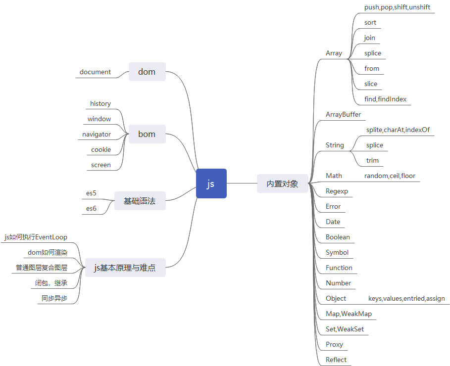
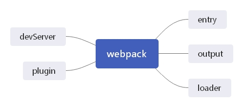
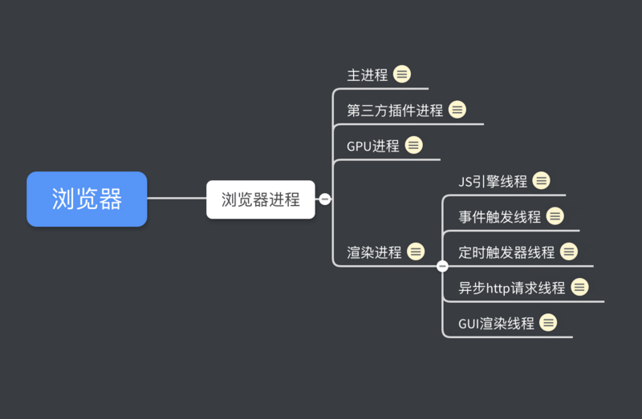

# 1、html
### 1.1、img标签title与alt区别，PNG,GIF,JPG的区别及如何选,base64优缺点,与Svg区别？
### 1.2、iframe优缺点？
### 1.3、html5离线存储原理？
### 1.4、页面回流重绘？
### 1.5、html5新特性用过那些 ？
# 2、css,less,scss
### 2.1、postcss的作用？
### 2.2、stylus/sass/less区别？
### 2.3、CSS在性能优化方面的实践？
### 2.4、CSS样式position: sticky;属性详解？
### 2.5、介绍一下重绘与回流？
### 2.6、介绍一下rem方案和vw方案？
### 2.7、移动端1px问题是怎么解决的？
# 3、js

### 3.1、Js是如何运行的？
[Js中EventLoop你了解吗？](https://juejin.im/post/5dd23239f265da0bf2112366)
### 3.2、Js基础类型和引用类型，深拷贝，浅拷贝？
[Js深拷贝浅拷贝？](https://editor.csdn.net/md/？articleId=84581549)
### 3.3、Js执行上下文？
### 3.4、Js作用域链？
### 3.5、Array中splice与slice区别？
[Array中splice与slice区别？](https://juejin.im/post/5e8c382051882573b9170f2f)
### 3.6、String中substring  substr  slice异同？
[String中substring  substr  slice异同？](https://juejin.im/post/5e8c38fce51d4546c4233d48)
### 3.7、ES5中apply,bing,call？
[ES5中apply,bing,call解析？](https://juejin.im/post/5e96ad12f265da47c71215ad)
### 3.8、ES6中promise？

# 4、ts
# 5、webpack

### 5.1、webpack基本原理？
### 5.2、webpack的loader了解吗？
### 5.3、如何实现多入口？
# 6、vue,react,angular
### 6.1 Angular与Vue生命周期？
[Angular与Vue生命周期？](https://juejin.im/post/5e16988ff265da5d5d7442b3)
### 6.2 Angular与Vue路由钩子？
### 6.3 Vuex与Service？
### 6.4 Angular与Vue组件间通信？
### 6.5 Angualr与Vue原理(Angular 脏检查实现原理与Vue双向绑定原理)？
### 6.6 Angular与Vue区别？
### 6.7 React与Vue的diff算法？
### 6.8 Vuex原理？
### 6.9 Vue-Router原理？
### 6.10 nextTick是如何实现的？
### 6.11 defineProperty和proxy有什么区别？
# 7、原理与算法
### 7.1、`async,await`和`Generate`和`Promise`原理？
### 7.2、如何搭建一个项目？
### 7.3、请用算法实现，从给定的无序、不重复的数组A中，取出N个数,使其相加和为M？
# 8、浏览器

### 8.1 渲染进程如何渲染的,浏览器输入url到页面展示过？
### 8.2 http与https异同
### 8.3 http状态码及其含义
# 思想
### 组件化思想
- 组件分类
不需要操作组件（传入一个值对象）（传入一个id然后组件内部进行请求数据）
需要操作组件（传入数据，组件内部进行修改）
- 组件化在性能相等的原则下，独立升级和维护是最大原则 =》 高内聚，低耦合， 模块化, 组件化