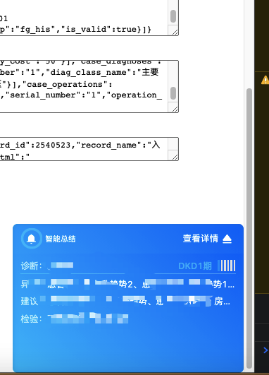
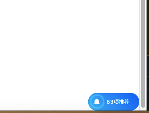

# rxjs学习?

### Subject与BehaviorSubject区别？

`BehaviorSubject` 默认必须有一个值，初始化的时候就会调用,而且获取最新消息，每一次next('1')与next('2')
`Subject` 默认没有值，初始化不会调用
    <video src="./videos/resize.mov" controls="controls" width="500" height="300">您的浏览器不支持播放该视频！</video>
### takeUntil && takeWhile
都是rxjs操作符
如图鼠标移上去

takeUntil

takeWhile

