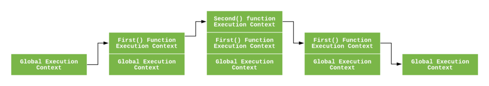

# 改变函数指针的方法
改变函数指针,也就是改变this指向,this也就是执行上下文,目前改变函数指针的方法有三种call,apply,bind
### 执行上下文类型
JavaScript中有三种执行上下文类型
- **全局执行上下文** : 默认的上下文，this指向window对象（浏览器情况下），
- **函数执行上下文** : 每当一个函数被调用时，都会为函数创建一个新的上下文，每个函数都有自己的执行上下文，不过函数上下文都是在函数被调用时创建的
- **Eval函数执行上下文**
# 执行栈
执行栈也就是调用栈，当js引擎遇到脚本时，首先它会创建一个全局执行上下文并且压入当前执行栈，每当引擎遇到一个函数调用时，它会为该函数创建一个新的执行上下文并压入栈的顶部

引擎会执行那些执行上下文位于栈顶的函数，当该函数执行结束时，执行上下文中从栈中弹出，控制流程达到当前栈中的下一个上下文

```
let a = 'Hello World!';

function first() {
  console.log('Inside first function');
  second();
  console.log('Again inside first function');
}

function second() {
  console.log('Inside second function');
}

first();
console.log('Inside Global Execution Context');

```


上述代码的执行上下文栈。遇到函数执行的时候，就会创建一个执行上下文

当上述代码在浏览器加载时，Js引擎创建了一个全局执行上下文并把它压入当前执行栈。当遇到`first()`函数调用时，Js引擎为该函数创建一个新的执行上下文并把它压入当前执行栈的顶部

当从`first()`函数内部调用`second()`函数时,Js引擎为`second()`函数创建了一个新的执行上下文并把它压入执行栈的顶部,当`second()`函数执行完毕,它的执行上下文会从当前栈弹出,并且控制流程到达下一个执行上下文,即`first()`函数执行上下文。

当`first()`执行完毕,它的执行上下文从栈弹出,控制流程到达全局执行上下文,一旦所有代码执行完毕,Js引擎从当前栈中移除全局执行上下文

# 怎么创建执行上下文
js创建引擎分为两个阶段
- 创建阶段

1、 this值的决定

2、 创建**词法环境**组件

3、 创建**变量环境**组件

```
ExecutionContext = {
  ThisBinding = <this.value>;
  LexicalEnviroment = { ... };
  VariableEnviroment = { ... };
}
```
### this值的决定

在全局执行上下文中,`this`的值指向全局对象。`this`应用window对象

在函数执行上下文中,`this`的值取决于函数时如何被调用的,如果它被一个引用对象调用，那么`this`会被设置成那个对象，否侧`this`的值被设置为全局对象或者`undefined`
```
let foo = {
  a: 1,
  baz: function() {
    console.log(this);
    console.log(this.a);
  }
}
foo.baz(); // this指向foo
let baz = foo.baz;
baz(); // this指向window
```
### 词法环境
词法环境是一种规范类型，基于ECMAScript代码的词法嵌套结构来定义标识符和具体变量和函数的关联。一个词法环境由环境记录器和一个可能的引用外部词法环境的空值组成。

在**词法环境**内部有两个组件:

(1) **环境记录器**: 是存储变量和函数声明的实际位置

(2) **一个外部环境的引用**: 可以访问父级词法环境